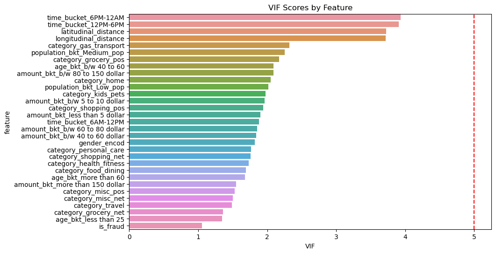

# Credit-Card-Fraud-Detection-Model

The data set comprised of simulated transactions of credit cards
 between January 1, 2020 and December 31, 2020, including both
 legitimate and fraudulent transactions in the western side of the United
 States of America available at https://www.kaggle.com/datasets/kar
 tik2112/fraud-detection. Haris’s (2020) sparkov data generation was
 implemented for the simulation. It includes transactions made to a pool
 of 800 businesses using the credit cards of 1000 customers.

 ### About data

 0. date_time_num : date_time of transactions
 1. cc_num is the unique id for the given customer
 2. merchant : merchant name
 3. category: There are around 14 categories type of transaction maximum for gas_transport
 4. amt: amount of transactions (have alot of outliers to handle that bucketization is done and converted to categorical data)
 5. gender : Male and Female have almost similar distribution
 6. street
 7. city
 8. name
 9. state
 10. zip
 11. lat
 12. long
 13. merch_lat : merchant latitude
 14. merch_log
 15. city_pop : population of the city
 16. trans_num: transaction_id of customer
 17. dob: date of birth
 18. IS Fraud : Target Variable Fraud/ Not Fraud

 EDA Findings

 1. percentage of fraud in each time bucket
 12AM-6AM    1.033238
12PM-6PM    0.118871
6AM-12PM    0.108067
6PM-12AM    1.042960

2. The highest number of fraud occure when amount in the "more than 150 dollar" and "b/w 10 to 40 dollar"
3. The highest number of fraud occure when category in the "shopping" and "grocery".
4. Customers whose age is greater than 60 is more suspectible to Fraud
 

 Result of chi-square test is:

 Feature	Chi-Square	p-value	Degrees of Freedom	Significant	Cramer's V
0	time_bucket	4815.016276	0.000000e+00	3	True	0.060937
1	amount_bkt	46303.754281	0.000000e+00	6	True	0.188970
2	category	6486.003270	0.000000e+00	13	True	0.070725
3	gender	75.514566	3.627211e-18	1	True	0.007631
4	population_bkt	6.059791	4.832070e-02	2	True	0.002162
5	age_bkt	221.945012	7.625344e-48	3	True	0.013083

--- One hot encofing is done to handle categorical data

check for the vif

VIF < 5: No concerning multicollinearity

5 ≤ VIF < 10: Moderate multicollinearity

VIF ≥ 10: High multicollinearity (consider removing or combining features)

